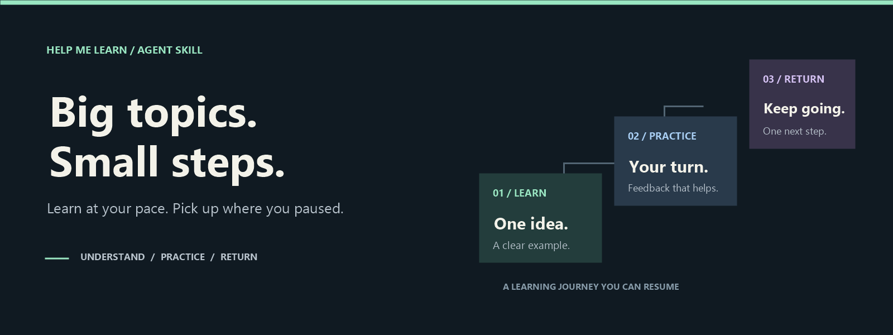
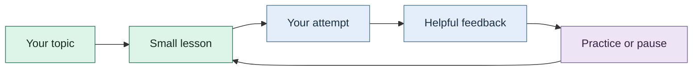

<p align="center">
  
</p>

<h1 align="center">Help Me Learn</h1>

<p align="center">
  <strong>An adaptive learning skill for people with ADHD or difficulty sustaining attention.</strong><br>
  Bring your curiosity. Work through one idea. Leave with a clear next step.
</p>

<p align="center">
  
  
  
  
</p>

<p align="center">
  <a href="#get-started"><strong>Get started</strong></a> &nbsp;·&nbsp;
  <a href="#how-it-works">Learning journey</a> &nbsp;·&nbsp;
  <a href="#optional-integrations">Integrations</a> &nbsp;·&nbsp;
  <a href="help-me-learn/USAGE.md">Usage guide</a>
</p>

---

Bring a topic, PDF, article, or documentation page. Help Me Learn guides your AI agent to break it into chapters, teach one small unit at a time, check your understanding, and explain how to improve your answers.

Designed for agents such as **Codex CLI, Claude Code, and OpenCode**, with optional **Excalidraw** diagrams and **Obsidian** study notes. The core workflow uses Markdown instructions and can run as a text conversation.

<table>
  <tr>
    <td width="50%" valign="top">
      <h3>01 &nbsp; Start small</h3>
      <p>One idea, one example, one next action. Begin without a long questionnaire or elaborate setup.</p>
    </td>
    <td width="50%" valign="top">
      <h3>02 &nbsp; Make it click</h3>
      <p>Adjust the pace and depth. Use a different example, a diagram, or a simpler explanation when you need it.</p>
    </td>
  </tr>
  <tr>
    <td width="50%" valign="top">
      <h3>03 &nbsp; Test the idea</h3>
      <p>Answer in your own words. Get specific feedback, clear reasoning, and a fresh chance to practice.</p>
    </td>
    <td width="50%" valign="top">
      <h3>04 &nbsp; Find your place</h3>
      <p>Save your position and prior hints when storage is available. Return to one useful next step.</p>
    </td>
  </tr>
</table>

## Get started

With Node.js and `npx` available, install the skill using the [skills CLI](https://github.com/vercel-labs/skills):

```bash
npx skills add https://github.com/Raslan07/help-me-learn/tree/main/help-me-learn --skill help-me-learn
```

Follow the prompts to choose your agent. Add `-g` to make it available across projects. The URL points directly to the skill folder inside this repository.

Then ask your agent:

> [!TIP]
> Start with one outcome and one primary resource. A short session can focus on a single useful idea.

```text
Use the help-me-learn skill.

I want to learn Python functions.
My goal is to write a function with parameters and a return value.
I'm a beginner and have about 15 minutes today.

Teach one small unit at a time and ask questions individually.
Let me attempt the answers before showing solutions.
```

You can provide your own file or URL, choose a different topic, and specify your preferred language. For example: “Explain in Arabic, keeping the technical terms in English.”

<details>
<summary><strong>Prefer to use a local copy?</strong></summary>

Ask an agent with file access to read [`help-me-learn/SKILL.md`](help-me-learn/SKILL.md). Keep its `references/`, `assets/`, and `scripts/` folders together.

</details>

---

## How it works



**The journey:** choose a topic, work through small lessons, attempt questions, review the reasoning, then practice or pause before continuing.

1. **Build a roadmap.** Organize the topic around your goal and prerequisites, expanding only the current chapter.
2. **Learn in small units.** Work through one idea, a concrete example, and a short practice task.
3. **Check understanding.** Answer a chapter question set, normally one question at a time. Hints and full solutions are available when you request them.
4. **Review your reasoning.** See what you got right, the specific gap, a worked solution, and why your approach did or did not work. Try a fresh example when needed.
5. **Resume with context.** Save your position, prior hints, remaining gaps, and one next action when file access is available. Otherwise, receive a copyable resume note.

The skill distinguishes guided success from independent understanding. Reading a chapter does not automatically mark it as learned, and skipping a question does not count as an incorrect answer.

> [!NOTE]
> The pace adapts to you. These are design choices, not a claim that everyone with ADHD learns the same way. Help Me Learn provides educational support; it does not diagnose or treat ADHD. See [evidence and adaptation](help-me-learn/references/evidence-and-adaptation.md).

## Resources you can bring

**Start with a topic, a document, or something you want to understand.**

<details>
<summary><strong>Explore supported resources and their limits</strong></summary>

| Resource | How it is handled |
| --- | --- |
| Topic only | Start with general explanations or verified sources when browsing is available. |
| Text and Markdown | Read directly or use the bundled extractor with line and heading locators. |
| PDFs | Use host tools or optional PDF extraction with file page numbers and page labels. Scans may require separate OCR or image inspection. |
| Word documents | Extract main-body paragraphs and tables from `.docx` files. |
| Articles and documentation | Read through the host's browsing tools or use a supplied extract. |
| Diagrams, charts, and visualizations | Inspect through available host capabilities; use a description or text alternative when inspection is unavailable. |

The skill instructs the agent to identify inaccessible content and extraction limits rather than invent missing material. See [resource handling](help-me-learn/references/resources-and-visuals.md).

</details>

## Optional integrations

<table>
  <tr>
    <td width="50%" valign="top">
      <h3>Excalidraw</h3>
      <p><strong>See the relationship.</strong></p>
      <p>Draw and revise concept maps, sequences, and visual explanations through connected MCP tools.</p>
      <a href="help-me-learn/references/excalidraw.md">Explore the drawing workflow →</a>
    </td>
    <td width="50%" valign="top">
      <h3>Obsidian</h3>
      <p><strong>Keep your place.</strong></p>
      <p>Save chapter notes, answer reviews, and a course home page with your next action.</p>
      <a href="help-me-learn/references/obsidian.md">Explore the notes workflow →</a>
    </td>
  </tr>
</table>

Example request:

```text
Use Excalidraw when a diagram helps explain the current idea.
Save my notes in the Obsidian vault I select, under Learning/Python Functions.
Check which tools are connected. If either integration is unavailable,
continue in text and tell me what has not been saved.
```

> [!NOTE]
> Installing the skill does not install or connect MCP servers. Configure them in your agent separately. A diagram displayed in chat is not automatically saved in Obsidian.

---

## Make a session useful

Start with **one concrete outcome and one primary resource**. Attempt the questions in your own words, then use feedback to repair a specific gap. When a diagram appears, explain its relationships instead of only looking at it.

Useful requests:

| When you need… | Say… |
| --- | --- |
| Less information | “Only show the next small step.” |
| A different explanation | “Use another example and check what prerequisite I'm missing.” |
| Help without the answer | “Give me one hint.” |
| A stopping point | “Pause and save my position and next action.” |
| To return later | “Resume from my saved course record and give me one recall question.” |

For a new agent session, provide the saved course location. Persistent memory depends on accessible saved records. More examples are in the [usage guide](help-me-learn/USAGE.md).

## Package contents

<details>
<summary><strong>Look inside the skill</strong></summary>

```text
help-me-learn/
├── SKILL.md          # Core teaching instructions
├── USAGE.md          # Practical prompts and usage guidance
├── VALIDATION.md     # Checks performed and known limits
├── references/       # Assessment, source handling, state, and MCP workflows
├── assets/           # Chapter, review, resume, and Obsidian templates
├── scripts/          # Resource extraction and session-state helpers
└── tests/            # Helper regression tests
```

The Python helpers are optional. `session_state.py` validates and saves progress, checks prerequisite readiness, and drafts generic repair questions without changing state. `extract_resource.py` adds heading paths and source-scoped block IDs while preserving its original record format. Both use the standard library for their core work; PDF extraction needs `pypdf` in the Python environment running the script:

```bash
python -m pip install pypdf
```

Keep learner answers and progress in a separate workspace or selected vault. See [state schema and commands](help-me-learn/references/state-schema.md) before using the helpers directly.

</details>

## Validation and compatibility

The local helper suite passed **36 tests** on Windows with Python 3.14.7, including prerequisite graphs, repair drafts, heading extraction, Unicode output, state validation, and failed-write recovery. The skill structure, reference links, and template YAML were also checked.

Run the helper tests from the repository root:

<details>
<summary><strong>Run the checks</strong></summary>

```bash
python -m unittest discover -s help-me-learn/tests -v
```

</details>

PDF integration tests skip if `pypdf` is absent. End-to-end installation and teaching behavior across all three CLIs have not been tested. MCP exports, vault writes, OCR, and rendering depend on the connected tools. Full details: [validation report](help-me-learn/VALIDATION.md).

---

<p align="center">
  <strong>One idea. One attempt. One next step.</strong><br><br>
  <a href="#get-started">Start learning</a> &nbsp;·&nbsp;
  <a href="help-me-learn/USAGE.md">Read the guide</a> &nbsp;·&nbsp;
  <a href="help-me-learn/SKILL.md">Explore the skill</a>
</p>
